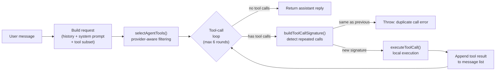

# Diet Agent — Assignment Report

> **Project Name**: Diet Agent (a.k.a. 猫猫虫 / Caterpillar Diet Coach)
>
> **Tech Stack**: Electron 33 · React 18 · TypeScript 5 · Ant Design 5 · Dexie (IndexedDB)
>
> **Repository**: [Chuwhyangle/DietAgnet](https://github.com/Chuwhyangle/DietAgnet)

---

## 1. Background & Problem Definition

### 1.1 The Problem

Everyday diet management presents four recurring pain points:

1. **High logging friction**: Traditional diet apps require users to select ingredients one by one and enter gram weights. A single meal takes ~5 minutes to log, and most users abandon the app within days.
2. **Static plans**: A fixed meal template says "breakfast 500 kcal, lunch 700 kcal, dinner 600 kcal," but when the user eats 500 kcal extra at lunch, nothing tells them how to adjust dinner to stay on target.
3. **Context-free reminders**: A timer-based reminder fires "time to eat!" at 9:00 AM even if the user already logged breakfast at 8:00 AM—context-free nudges quickly become noise.
4. **No memory of the user**: Every conversation starts from scratch. The user must repeatedly explain "I'm allergic to peanuts," "I don't drink milk," or "I don't get off work until 9 PM."

### 1.2 Why This Is an Agent Problem

| Dimension | Form-based App | Single-turn Chatbot | **Agent** ✅ |
|---|---|---|---|
| Goal decomposition | User does it manually | User does it manually | Automatically derives daily kcal and per-meal ratios from a target weight |
| Multi-step reasoning | Not supported | Ends after one turn | `recall` preferences → `check_today_plan_gap` → `search_recipe` → `add_meal` → reply |
| Proactive behavior | Fixed-time triggers | Never proactive | Context-aware: missed meals, plan drift, auto-pause after consecutive dismissals |
| Long-term memory | Fixed form fields | Context-window only | Persists preferences / allergies / schedule; extracts candidate memories from chat asynchronously |
| Auditability | Direct data mutation | N/A | High-risk, model-estimated, or suggestion-type writes go through confirmation / review / audit workflows; user-initiated meal logs and settings updates write directly and trigger downstream dynamic suggestions and audit records via the event system |

Core thesis: the agentic approach in this project is **not using LLM for the sake of it**—it is adopted because "making contextual decisions + invoking real tools + learning over time" is precisely what the Agent paradigm excels at.

### 1.3 Motivation

- **Data sensitivity**: Diet, health, and weight data naturally demand local storage, validating a "lightweight local Agent" approach.
- **High-frequency, low-noise interaction**: ~3–5 interactions per day—ideal for exercising long-term memory and proactive behavior.
- **Quantifiable evaluation**: Whether a meal was logged, how large the deviation is, whether a reminder was adopted—all have numeric indicators for objective assessment.

---

## 2. System Architecture

### 2.1 Process Topology

Built on Electron 33 + electron-vite, the app runs across three JS process domains:

| Process | Primary Responsibilities | Entry Files |
|---|---|---|
| **Main Process** | Window lifecycle, system tray, OS notifications, API Key secure storage (`safeStorage` encryption), remote LLM proxy, background 30-min tick | [index.ts](https://github.com/Chuwhyangle/DietAgnet/blob/main/src/main/index.ts), [agent.ts](https://github.com/Chuwhyangle/DietAgnet/blob/main/src/main/agent.ts) |
| **Preload** | Exposes a restricted IPC API to the renderer via `contextBridge` | [preload/index.ts](https://github.com/Chuwhyangle/DietAgnet/blob/main/src/preload/index.ts) |
| **Renderer** | UI rendering, Agent controller, tool execution, planning / memory / knowledge / reminder modules | [renderer/src/](https://github.com/Chuwhyangle/DietAgnet/tree/main/src/renderer/src) |

### 2.2 Component Architecture

```mermaid
flowchart TB
    subgraph User["User Layer"]
        UI["React UI<br/>(Home, Recipes, DietLog, Chat, Settings)"]
        ChatUI["AgentChat UI"]
        Reminders["ProactiveReminder<br/>(In-app Toast)"]
    end

    subgraph Agent["Agent Layer (Renderer)"]
        Ctrl["Agent Controller<br/>tool-call loop (max 6 rounds)"]
        Prompt["System Prompt Builder<br/>persona + memory + rhythm"]
        Tools["Tool Registry<br/>37 tools"]
    end

    subgraph Cognition["Cognition Modules"]
        Memory["Long-term Memory<br/>manager / matcher /<br/>postChatExtraction"]
        Knowledge["Knowledge Base<br/>retriever / reranker /<br/>lightweight term matching"]
        Planning["Planning Engine<br/>engine / dynamicPlan"]
        Habits["Rhythm Summary<br/>rhythmSummary"]
    end

    subgraph Proactive["Proactive Layer"]
        Scheduler["Reminder Scheduler<br/>reminderScheduler"]
        Rules["Proactive Rules<br/>rules.ts"]
        Drift["Plan Drift Monitor<br/>planDriftMonitor"]
    end

    subgraph Storage["Local Storage Layer"]
        LS[("localStorage<br/>settings / dietLog / chat / calibration")]
        Dexie[("Dexie / IndexedDB<br/>plan / memory / proactive events")]
    end

    subgraph Main["Main Process"]
        IPC["IPC Bridge"]
        SafeStore["safeStorage<br/>encrypted API Key"]
        LLMProxy["LLM Proxy"]
        BgTick["Background 30min Tick"]
    end

    ChatUI --> Ctrl
    Ctrl --> Prompt
    Ctrl --> Tools
    Prompt --> Memory
    Prompt --> Habits
    Tools --> Memory
    Tools --> Knowledge
    Tools --> Planning
    Tools --> Storage
    Scheduler --> Rules
    Scheduler --> Storage
    Drift --> Planning
    Ctrl -->|chat-completions IPC| IPC
    IPC --> SafeStore
    IPC --> LLMProxy
    BgTick --> Scheduler
    Reminders <-- Scheduler
```

### 2.3 Agent Controller Flow

The Agent Controller ([controller.ts](https://github.com/Chuwhyangle/DietAgnet/blob/main/src/renderer/src/agent/controller.ts), 241 lines) is the core scheduler:



Key design parameters:
- `MAX_TOOL_ROUNDS = 6`: at most 6 rounds of tool-call loops
- `MAX_HISTORY_MESSAGES = 20`: context window capped at 20 messages
- **Provider-aware tool subset selection**: for custom providers, `selectAgentTools()` matches tool groups by user input semantics to avoid context explosion

### 2.4 Data Persistence

| Data Type | Storage Medium | Source File |
|---|---|---|
| User settings, diet log, chat history, calibration audit | `localStorage` | `stores/settings.ts`, `stores/dietLog.ts`, etc. |
| Planning profile, PersonalDietPlan, long-term memory, ProactiveEvent, DailyPlanAdjustment | Dexie database `diet-agent-planning` | `stores/planning.ts` |
| API Key | Electron `safeStorage` encryption | `src/main/agent.ts` |

---

## 3. Agentic Capabilities

This project implements a working minimum viable loop around seven categories of agentic capability. Each is analyzed below.

### 3.1 🎯 Goal-directed Action

The Agent is not a passive Q&A bot—it operates around the user's **concrete dietary goals**.

**Implementation**:
- **Express Onboarding** ([expressOnboarding.ts](https://github.com/Chuwhyangle/DietAgnet/blob/main/src/renderer/src/coaching/expressOnboarding.ts)): the user fills in just 5 fields (gender, height, weight, target weight, activity level) and receives a `PersonalDietPlan` within 60 seconds, including daily kcal target and per-meal calorie ratios.
- **Plan drift monitoring** ([planDriftMonitor.ts](https://github.com/Chuwhyangle/DietAgnet/blob/main/src/renderer/src/coaching/planDriftMonitor.ts)): after each diet log entry, the system automatically compares actual intake against the day's plan target.
- **Goal-oriented suggestions**: when plan context is available, the Agent preferentially includes goal-oriented advice such as "you have XXX kcal remaining today—consider keeping dinner light."

### 3.2 🔗 Multi-step Reasoning

The Agent can decompose a single natural-language request into a multi-step tool-call chain.

**Example**—user says "I had kung pao chicken and rice for lunch, oh and I'm allergic to peanuts":

| Round | Agent Behavior |
|---|---|
| Round 1 | LLM returns 3 tool calls: `search_recipe("kung pao chicken")`, `search_recipe("rice")`, `remember(type=allergy, content="peanut allergy")` |
| Round 2 | Tool results return → LLM decides to call `add_meal({ lunch, items: [kung-pao-chicken, rice] })` |
| Round 3 | `add_meal` writes to the diet log and fires a `DIET_LOG_UPDATED_EVENT`; the `dietLogCoach` listener asynchronously computes `DailyPlanGap` and generates a dynamic adjustment suggestion if the deviation exceeds thresholds |
| Round 4 | LLM synthesizes all tool results into a final reply |

Additionally, the Agent can explicitly call the `suggest_plan_adjustment` tool to generate and persist a dynamic plan suggestion.

**Safety guardrails**:
- Maximum 6 rounds of tool-call loops to prevent infinite recursion ([controller.ts:30](https://github.com/Chuwhyangle/DietAgnet/blob/main/src/renderer/src/agent/controller.ts#L30))
- `buildToolCallSignature()` detects repeated identical calls to prevent infinite loops ([controller.ts:146-153](https://github.com/Chuwhyangle/DietAgnet/blob/main/src/renderer/src/agent/controller.ts#L146-L153))

### 3.3 🔧 Tool Use

The project registers **37 tools** in [tools.ts](https://github.com/Chuwhyangle/DietAgnet/blob/main/src/renderer/src/agent/tools.ts) (2,448 lines, 80 KB), organized into 7 categories:

| Category | Count | Representative Tools |
|---|---|---|
| Data queries | 8 | `get_today_nutrition`, `get_diet_log`, `get_week_summary`, `get_current_plan` |
| Meal logging | 5 | `add_meal`, `add_custom_food_meal`, `remove_meal_item` |
| Recipe operations | 4 | `search_recipe`, `get_recipe_detail`, `recommend_recipe` |
| Plan management | 7 | `check_today_plan_gap`, `suggest_plan_adjustment`, `suggest_meal_plan` |
| Long-term memory | 6 | `remember`, `recall`, `forget`, `list_user_facts`, `update_memory_confidence` |
| Knowledge base | 4 | `search_knowledgebase`, `lookup_food_nutrition`, `find_foods_by_criteria` |
| Calibration audit | 3 | `estimate_recipe_nutrition`, `list_recipe_calibrations`, `review_recipe_calibration` |

**Smart tool selection**: for custom providers, `selectAgentTools()` matches tool groups by user-input semantics ([controller.ts:117-144](https://github.com/Chuwhyangle/DietAgnet/blob/main/src/renderer/src/agent/controller.ts#L117-L144)). Base tools are always active; planning / memory / knowledge / calibration groups activate on keyword match, avoiding sending all 37 tool definitions to the LLM at once.

### 3.4 One-Tap Logger & Multi-entry Interaction

Beyond chat-based interaction, the system also provides a One-Tap Logger ([oneTapLogger.ts](https://github.com/Chuwhyangle/DietAgnet/blob/main/src/renderer/src/coaching/oneTapLogger.ts)): users can log meals via a single line of text, photo estimation, common-food shortcut buttons, or a "same as yesterday" option. Text / image estimation is handled by an OpenAI-compatible LLM or vision model, and the result feeds into the local logging and dynamic planning pipeline. Photo-based recognition is not a native CV pipeline—accuracy depends on model capability, camera angle, and portion estimation—and is therefore discussed as a known limitation in the Reflection section.

### 3.5 🧠 Memory

The long-term memory system is one of the project's **most distinctly agentic** capabilities, operating on three levels:

#### Explicit Memory
User says "remember that I'm allergic to peanuts" → Agent calls `remember` tool → writes to Dexie, classified as `allergy`, confidence ≥ 0.9.

#### Implicit Memory Extraction (Background Learning)
After each conversation turn, [postChatExtraction.ts](https://github.com/Chuwhyangle/DietAgnet/blob/main/src/renderer/src/memory/postChatExtraction.ts) **asynchronously** calls the LLM to extract candidate memories from the dialogue:

```
User: "Worked overtime until 10 PM today, just had some instant noodles"
  → Background extraction: { type: "schedule", content: "May work overtime until 22:00 on weekdays", confidence: 0.6 }
  → Confidence ≥ threshold → written directly to active
  → Lower confidence → enters pending_confirm status, visible in Settings, user decides
```

Safety constraint: allergy / avoidance types (`allergy` / `avoidance`) are **never auto-committed**; they require user confirmation ([postChatExtraction.ts:23](https://github.com/Chuwhyangle/DietAgnet/blob/main/src/renderer/src/memory/postChatExtraction.ts#L23)).

#### Memory Injection into Prompt
Each time the system prompt is built, [prompt.ts](https://github.com/Chuwhyangle/DietAgnet/blob/main/src/renderer/src/memory/prompt.ts) automatically fetches active memories + diet rhythm summary for injection. Before recommending recipes, the Agent first calls `recall` to retrieve allergies / avoidances and exclude conflicting ingredients.

**Memory types**: `preference` / `allergy` / `avoidance` / `habit` / `schedule` / `health_note` / `goal` / `other`

### 3.6 📋 Planning

Planning is implemented in two layers—static plans and dynamic plans:

| Layer | Implementation | Key Module |
|---|---|---|
| **Static plan** | Express Onboarding / 13-step guided questionnaire → generates PersonalDietPlan | [engine.ts](https://github.com/Chuwhyangle/DietAgnet/blob/main/src/renderer/src/planning/engine.ts) |
| **Dynamic plan** | Diet log event triggers `DailyPlanGap` computation → generates supplement / reduce suggestions when deviation exceeds threshold → writes audit record | [dynamicPlan.ts](https://github.com/Chuwhyangle/DietAgnet/blob/main/src/renderer/src/planning/dynamicPlan.ts) |

Dynamic plan trigger mechanism: after `add_meal` writes to dietLog, it fires a `DIET_LOG_UPDATED_EVENT`; the `dietLogCoach` listener (registered at app startup) debounces briefly and then asynchronously calls `evaluateDailyPlanAdjustment`, which computes the DailyPlanGap and writes dynamic suggestions / chat summaries / desktop notifications according to user settings.

**Safety filtering** ([dynamicPlan.ts:74-83](https://github.com/Chuwhyangle/DietAgnet/blob/main/src/renderer/src/planning/dynamicPlan.ts#L74-L83)):
- `HEALTH_CAUTION_RE`: triggers conservative mode upon detecting keywords like "doctor's orders / diabetes / pregnancy / minor / eating disorder"
- `EXTREME_LANGUAGE_REPLACEMENTS`: automatically softens aggressive phrasing (e.g., "skip the next meal" → "make a gentle adjustment at the next meal")
- **Plan immutability**: new plans never overwrite the ID of an accepted plan; they are always inserted as new rows (enforced by property tests)

### 3.7 ⚡ Proactive Behavior

The Agent **does not wait for the user to speak**—it actively observes and nudges.

**Dual-layer tick mechanism**:
- **Foreground 10-min tick** (renderer process): checks for unlogged meals while the app is visible
- **Background 30-min tick** (main process): continues checking when the window is minimized to tray

**Adaptive strategies** ([reminderScheduler.ts](https://github.com/Chuwhyangle/DietAgnet/blob/main/src/renderer/src/coaching/reminderScheduler.ts), 720+ lines):
- **Quiet hours**: no reminders during user-configured quiet periods (enforced by property test)
- **Cooldown**: minimum interval between same-type reminders
- **Consecutive-dismiss pause**: auto-pauses for 24 hours after the user dismisses 3 consecutive same-type reminders
- **Escalation threshold**: increases reminder urgency after extended periods without logging

**Trigger scenario example**:
```
Current time 13:30 → lunch not yet logged → not in quiet hours → cooldown elapsed
  → Write ProactiveEvent audit record
  → UI shows Toast: "Lunch hasn't been logged yet"
  → Buttons: Log now / Later / Dismiss
  → When window is minimized → deliver via OS notification
```

### 3.8 🧭 Decision Making

The Agent does more than execute instructions—it makes autonomous judgments at multiple decision points:

| Decision Point | Decision Logic |
|---|---|
| Recipe library miss | Does not return an error; instead follows the `add_custom_food_meal` estimation path, saving the result as a local custom food |
| Plan deviation exceeds threshold | Asynchronously triggers `evaluateDailyPlanAdjustment` via the event system, generating a supplement / reduce suggestion card |
| Memory confidence judgment | High confidence → auto-write to active; lower confidence → enters `pending_confirm` status |
| Provider incompatibility | Detects endpoints that do not support `tool_calls` and auto-degrades to plain chat mode |
| Safety language replacement | Detects aggressive suggestions like "skip the next meal" and auto-replaces with gentler phrasing |
| **Trust Dial** | In `autopilot` mode, high-confidence estimates are saved automatically; in `precision` mode, every record requires user confirmation |

---

## 4. Implementation Quality

### 4.1 Engineering Metrics

| Metric | Value |
|---|---|
| Language | TypeScript 5 (strict mode) |
| Major modules | 30+ (agent / coaching / planning / memory / knowledge / proactive / habits / stores / pages / components) |
| Agent tools | 37 |
| Test files | 71 |
| Test cases | 654 |
| Property test files | 10 |
| Core property-test invariants | 9 (plus additional export / round-trip property tests) |
| Test budget | `npm run test:budget` measured ~36 s, budget 90 s |
| Coverage gates | Configured: global lines/statements 80%, branches 70%, functions 75%; components/pages tier 50% lines/statements, 40% branches, 50% functions. All regular tests pass green, but coverage has not yet reached the global gates and still requires additional tests. |
| Recipe data validation | `npm run validate:recipes`, 130 recipes pass validation |

### 4.2 Three-tier Test Architecture

| Tier | Coverage Scope | Test Approach |
|---|---|---|
| **Tier 1 (Pure logic)** | Parsers, validators, schedulers, planners | Example Test + Property Test |
| **Tier 2 (Integration glue)** | Agent Controller, Tools, IPC Handlers | Integration tests with deterministic mocks |
| **Tier 3 (Presentation)** | React components and pages | Mount smoke test + single-interaction assertion |

### 4.3 Nine Property-Test Invariants

These invariants are hard constraints; violating any one causes test failure:

1. **Parser round-trip consistency** — `parse(serialize(x))` is structurally equivalent within ±0.01 float tolerance
2. **Quiet-hours compliance** — no reminder events are generated during configured quiet periods
3. **Allergy ingredient filtering** — auto-recommendations never include user-allergenic / avoided ingredients
4. **Estimation consistency** — `|protein×4 + carbs×4 + fat×9 − calories| ≤ 0.20 × calories`
5. **Plan immutability** — new plans never overwrite accepted plan IDs; always inserted as new rows
6. **Recipe macro validation** — validator reports violations for recipes whose macros exceed tolerance
7. **Rhythm summary idempotency** — running the same input twice yields the same result
8. **Memory matcher order-independence** — shuffling active memory order does not change match decisions
9. **Plan gap arithmetic** — `|remaining + actual − target| ≤ 0.01`

### 4.4 Test Isolation Guarantees

- No real network (global `fetch` guard—calling `fetch` without a mock throws an error)
- No real clock (`vi.useFakeTimers()`)
- No cross-test persistent state (localStorage cleared + IndexedDB deleted before each test)
- Uncleaned real-clock timer detection: `afterEach` emits a structured warning and cleans up pending timers to prevent cross-test pollution; this check is currently a warning, not a hard failure gate.

---

## 5. Evaluation & Example Tasks

### 5.1 Eight Evaluation Tasks

| ID | Task | Agentic Capability Verified | Verification Method / Evidence | Result |
|---|---|---|---|---|
| T1 | "I had kung pao chicken and rice for lunch" | Tool use baseline + multi-step reasoning | Manual demo: observe tool-call log + dietLog write | ✅ Pass |
| T2 | "I just ate a 200g Sam's Club roast chicken leg" (out-of-library food) | Decision making (graceful degradation) | Manual demo: custom food appears in Settings page | ✅ Pass |
| T3 | "Remember: I'm allergic to peanuts" → "Recommend two light dishes for dinner" | Memory + Safety | [allergyFilter.property.test.ts](https://github.com/Chuwhyangle/DietAgnet/tree/main/src/renderer/src/coaching/__tests__) + memory manager tests | ✅ Pass |
| T4 | Manually add 3 servings of pasta causing plan deviation | Dynamic Planning | Manual demo: observe suggestion card + DailyPlanAdjustment audit record | ✅ Pass |
| T5 | Trigger tick at 13:30 with lunch unlogged | Proactive reminders | [reminderScheduler.test.ts](https://github.com/Chuwhyangle/DietAgnet/tree/main/src/renderer/src/coaching/__tests__), [quietHours.property.test.ts](https://github.com/Chuwhyangle/DietAgnet/tree/main/src/renderer/src/coaching/__tests__) | ✅ Pass |
| T6 | LLM repeatedly issues the same tool-call set | Robustness (infinite-loop guard) | [controller.test.ts](https://github.com/Chuwhyangle/DietAgnet/tree/main/src/renderer/src/agent/__tests__) | ✅ Pass |
| T7 | Custom endpoint does not support tool_calls | Compatibility degradation | Manual demo + controller code path coverage | ✅ Pass (degrades to plain chat) |
| T8 | "Worked overtime until 10 PM today" → background extraction of candidate memory | Background learning | Manual demo: Settings → Long-term Memory → pending confirmation list | ✅ Pass |

> Note: T1/T2/T4/T7/T8 are manual demo scenarios, reproducible by following the [README](https://github.com/Chuwhyangle/DietAgnet/blob/main/README.md#5-分钟-demo-跑通) steps after `npm run dev`. T3/T5/T6 have corresponding automated test coverage.

### 5.2 Known Failure Cases

The project **proactively discloses** the following failure cases to demonstrate genuine testing:

| ID | Failure Scenario | Mitigation | Unresolved |
|---|---|---|---|
| F1 | LLM calorie estimation ±30% deviation | Trust Dial `precision` mode + review workflow | No food barcode / brand database |
| F2 | Long conversation context truncation | Long-term memory persists across sessions | No conversation summarization |
| F3 | No reminders after app fully exits | Close button defaults to minimize-to-tray | No Windows Service |
| F4 | Custom endpoint doesn't support tool_calls | Auto-degrades to plain chat | Loses local tool write capability |
| F5 | Ambiguous user input | Agent tends to guess rather than ask for clarification | Prompt clarification strategy needed |

### 5.3 Performance Data

| Metric | Value |
|---|---|
| Cold start (dev mode) | ~3.5 s |
| First screen interactive | ~1.2 s |
| Single-turn plain chat latency | 1.5–3 s |
| 2–3 step tool-call latency | 5–10 s |
| Regular tests | ~38 s (71 files / 654 tests) |
| Test budget script | ~36 s, below the 90 s budget |
| Coverage tests | ~41 s, but currently below global coverage gates |

---

## 6. Critical Reflection

### 6.1 Known Limitations

1. **Remote LLM dependency**: no network means no Agent; no local LLM fallback. Conversation content is still sent to a third-party model, creating a privacy boundary.
2. **Limited calorie estimation accuracy**: the 130-recipe library uses estimated values; out-of-library foods rely on LLM real-time estimation with deviations up to ±30%.
3. **Single-machine, no cloud sync**: switching computers means losing data; no mobile client.
4. **Knowledge base is still lexical retrieval**: the current `knowledge/embedder.ts` uses lightweight lexical term embedding / token overlap, not a neural vector model; true semantic embedding retrieval remains a future direction.
5. **No medical diagnosis**: this is a deliberate design decision, not a technical shortcoming.

### 6.2 Privacy & Health Boundaries

Diet Agent adopts local-first storage: diet logs, plans, memories, and reminder events are primarily stored in localStorage / IndexedDB; API Keys are encrypted via Electron `safeStorage` in the main process. However, conversation content and estimation requests are still sent to the user-configured remote LLM, so the settings page should clearly indicate the data boundary with third-party models.

The project does not provide medical diagnoses and does not substitute for dietitian or physician advice; when keywords such as pregnancy, diabetes, minor, eating disorder, or doctor's orders are detected, the system enters conservative suggestion mode ([dynamicPlan.ts:77](https://github.com/Chuwhyangle/DietAgnet/blob/main/src/renderer/src/planning/dynamicPlan.ts#L77)). Future work should include data export, deletion, migration, and clearer privacy disclosures.

### 6.3 Key Design Trade-offs

| Trade-off | Choice | Rationale |
|---|---|---|
| Tools in renderer vs. main process | Renderer | Data lives in the renderer; avoids IPC serialization overhead. Sensitive API Keys are isolated to the main process. |
| Express (60 s) vs. full 13-step onboarding | Default Express | Full version completion rate <30%; Express significantly reduces new-user drop-off |
| Autopilot vs. Precision | Default Autopilot | Low friction is the core value of a coaching app; users can switch anytime |
| Memory confidence thresholds | Dual threshold + pending_confirm | High confidence → direct to active; lower confidence → pending confirmation, letting the user be the final arbiter |
| Send all tools vs. context-based subset | Provider-aware subset selection | Avoids context bloat; custom-endpoint behavior is more stable |

### 6.4 Lessons Learned

1. **Invest in the tool system from Day 1**: getting the first 7 core tools right early is far more valuable than bolting on 30 tools later.
2. **Treat "auditability" as a first-class citizen**: dynamic suggestions, memories, and calibrations all write to audit tables so that during demos you can "open DevTools and show the evidence."
3. **Property tests are the safety net for Agent projects**: conventional unit tests cannot cover invariants like "does allergy filtering still hold after shuffling memory order?"—but fast-check can.
4. **Don't try to ship every Agent capability at once**: nailing Goal / Memory / Planning / Proactive is more robust than also attempting RAG, CV, and voice in one pass.
5. **Local-first saves effort**: within the scope of an assignment, there is no need to spend engineering effort on cloud sync.

### 6.5 Potential Improvements

- **Agent clarification mechanism**: add a "when ambiguous, ask first" principle in the prompt to reduce logging errors from guessing.
- **Multi-model auto-comparison**: automatically run T1–T8 across multiple providers, outputting a cross-provider comparison of tool-call success rate and latency.
- **Semantic embedding retrieval**: introduce a true neural vector model to replace the current lexical retrieval, improving knowledge base semantic understanding.
- **Conversation summarization checkpoints**: summarize every ~20 turns to mitigate context truncation.
- **Portion size recognition**: when the user says "a bowl," offer quick-select options like "small bowl 200 g / medium 300 g / large 400 g."
- **True background reminders**: implement system-level ticks via Windows Service / macOS LaunchAgent so reminders work even after the app exits.
- **Cross-device sync**: start with manual import/export, then consider end-to-end encrypted P2P or self-hosted sync.
- **Mobile companion**: start with a read-only lightweight mobile client.
- **Wearable integration**: read HealthKit / Google Fit activity data to reverse-calibrate the daily kcal target.
- **Food barcode scanning**: serve as a hard-constraint fallback for LLM estimation.
- **Local LLM fallback**: run a small model locally via llama.cpp / Ollama for basic tool decisions; invoke cloud models only for complex tasks.
- **OS notification styling**: use Win11 native Toast XML API to avoid long-text truncation.
- **Coverage gap closure**: add test cases for modules currently below the coverage gates so that `npm run test:coverage` passes.

---

## 7. Conclusion

Diet Agent is a **local-first, auditable** agentic desktop diet coaching application. Beneath the seemingly simple "diet logging" scenario, it implements a working minimum viable loop around seven categories of agentic capability—**goal-directed action, multi-step reasoning, tool use, long-term memory, dynamic planning, proactive behavior, and autonomous decision making**.

The project is more than an MVP: it is an engineered product with **coverage gate configuration, 71 test files, 654 test cases, and 10 property test files**, along with **12 design / evaluation / reflection documents**. It validates the feasibility of a "lightweight local Agent" in a high-frequency, low-noise daily scenario, while honestly exposing real-world constraints including remote LLM dependency, estimation accuracy limits, coverage not yet reaching the configured gates, and single-machine limitations.

> **Core thesis**: Diet Agent is not a talking form, nor a chatbot with a wrapper. It is a diet coaching Agent that can **observe your diet logs, remember your preferences, compare against your plan, proactively remind you when you forget to log, and gently suggest adjustments when you overeat**.
