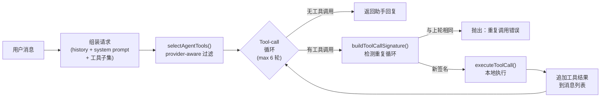

# Diet Agent — 大作业报告

> **项目名称**：Diet Agent（猫猫虫饮食助手）
>
> **技术栈**：Electron 33 + React 18 + TypeScript 5 + Ant Design 5 + Dexie (IndexedDB)
>
> **项目仓库**：[Chuwhyangle/DietAgnet](https://github.com/Chuwhyangle/DietAgnet)

---

## 一、项目背景与问题定义

### 1.1 要解决的问题

普通人在日常饮食管理中，普遍面临四个核心痛点：

1. **记录摩擦高**：传统饮食 App 要求逐一选择食材、填写克数，一顿饭需要花费 5 分钟录入，多数用户在几天之内放弃。
2. **计划是静态的**：减脂模板给出一份固定的"早午晚加餐各多少 kcal"的计划，但当用户中午临时多吃了 500 kcal 后，没有人告诉他"晚餐应该减多少"来维持全天目标。
3. **提醒缺乏上下文**：传统提醒到点就响"该吃饭了"，但如果用户早上 8 点已经记录过早餐，系统仍然在 9 点弹出早餐提醒——这种脱离上下文的提醒很快变成噪音。
4. **不记得用户是谁**：每次对话都要从零开始，用户需要反复解释"我对花生过敏""我不喝牛奶""我晚上 9 点才下班"等长期稳定的个人信息。

### 1.2 为什么这是一个 Agent 问题

| 维度 | 表单/静态 App | 单轮 Chatbot | **Agent** ✅ |
|---|---|---|---|
| 目标分解 | 用户自己拆 | 用户自己拆 | 自动从"目标体重"推导每日 kcal 与三餐比例 |
| 多步推理 | 不支持 | 一轮即结束 | 先 `recall` 偏好 → `check_today_plan_gap` → `search_recipe` → `add_meal` → 回复 |
| 主动行为 | 固定时间触发 | 不会主动 | 上下文感知：未记录餐次、计划偏差、连续忽略自动暂停 |
| 长期记忆 | 字段固定不变 | 仅上下文窗口内 | 持久化偏好/过敏/作息，对话后异步提炼候选记忆 |
| 可审计性 | 直接改写数据 | 不涉及 | 高风险、模型估算或建议类写操作进入待确认 / 审核 / 审计流程；用户明确触发的餐食记录和设置更新会直接落库，并通过事件系统触发后续动态建议与审计记录 |

核心论点：Agentic approach 在本项目中**不是为了使用 LLM 而使用**，而是因为"基于上下文做决策 + 调用真实工具 + 持续学习"这件事，恰好是 Agent 范式的核心擅长领域。

### 1.3 选题动机

- **数据敏感性**：饮食/健康/体重数据天然需要本地化存储，验证了"轻量本地 Agent"的可行性。
- **高频低噪交互**：日均 3~5 次交互，正好考察 Agent 的长期记忆和主动行为能力。
- **可量化评估**：是否记录、偏差多少、提醒是否被采纳，都有数字指标，便于客观评测。

---

## 二、系统架构

### 2.1 进程拓扑

应用基于 Electron 33 + electron-vite，分为三个 JS 进程域：

| 进程 | 主要职责 | 入口文件 |
|---|---|---|
| **Main Process** | 窗口生命周期、系统托盘、OS 通知、API Key 安全存储（`safeStorage` 加密）、远程 LLM 代理、后台 30 分钟 tick | [index.ts](https://github.com/Chuwhyangle/DietAgnet/blob/main/src/main/index.ts)、[agent.ts](https://github.com/Chuwhyangle/DietAgnet/blob/main/src/main/agent.ts) |
| **Preload** | 通过 `contextBridge` 暴露受限 IPC API 给渲染进程 | [preload/index.ts](https://github.com/Chuwhyangle/DietAgnet/blob/main/src/preload/index.ts) |
| **Renderer** | UI 展示、Agent 控制器、工具执行、计划/记忆/知识/提醒模块 | [renderer/src/](https://github.com/Chuwhyangle/DietAgnet/tree/main/src/renderer/src) |

### 2.2 组件架构图

```mermaid
flowchart TB
    subgraph User["User Layer"]
        UI["React UI<br/>(Home, Recipes, DietLog, Chat, Settings)"]
        ChatUI["AgentChat UI"]
        Reminders["ProactiveReminder<br/>(In-app Toast)"]
    end

    subgraph Agent["Agent Layer (Renderer)"]
        Ctrl["Agent Controller<br/>tool-call loop (max 6 rounds)"]
        Prompt["System Prompt Builder<br/>persona + memory + rhythm"]
        Tools["Tool Registry<br/>37 tools"]
    end

    subgraph Cognition["Cognition Modules"]
        Memory["Long-term Memory<br/>manager / matcher /<br/>postChatExtraction"]
        Knowledge["Knowledge Base<br/>retriever / reranker /<br/>lightweight term matching"]
        Planning["Planning Engine<br/>engine / dynamicPlan"]
        Habits["Rhythm Summary<br/>rhythmSummary"]
    end

    subgraph Proactive["Proactive Layer"]
        Scheduler["Reminder Scheduler<br/>reminderScheduler"]
        Rules["Proactive Rules<br/>rules.ts"]
        Drift["Plan Drift Monitor<br/>planDriftMonitor"]
    end

    subgraph Storage["Local Storage Layer"]
        LS[("localStorage<br/>settings / dietLog / chat / calibration")]
        Dexie[("Dexie / IndexedDB<br/>plan / memory / proactive events")]
    end

    subgraph Main["Main Process"]
        IPC["IPC Bridge"]
        SafeStore["safeStorage<br/>encrypted API Key"]
        LLMProxy["LLM Proxy"]
        BgTick["Background 30min Tick"]
    end

    ChatUI --> Ctrl
    Ctrl --> Prompt
    Ctrl --> Tools
    Prompt --> Memory
    Prompt --> Habits
    Tools --> Memory
    Tools --> Knowledge
    Tools --> Planning
    Tools --> Storage
    Scheduler --> Rules
    Scheduler --> Storage
    Drift --> Planning
    Ctrl -->|chat-completions IPC| IPC
    IPC --> SafeStore
    IPC --> LLMProxy
    BgTick --> Scheduler
    Reminders <-- Scheduler
```

### 2.3 Agent Controller 内部流程

Agent Controller（[controller.ts](https://github.com/Chuwhyangle/DietAgnet/blob/main/src/renderer/src/agent/controller.ts)，241 行）是整个 Agent 的核心调度器：



关键设计参数：
- `MAX_TOOL_ROUNDS = 6`：最多 6 轮工具调用循环
- `MAX_HISTORY_MESSAGES = 20`：上下文窗口最大 20 条消息
- **Provider-aware 工具子集选择**：对 custom provider，按用户输入语义匹配激活工具组，避免上下文爆炸

### 2.4 数据持久化

| 数据类型 | 存储介质 | 文件 |
|---|---|---|
| 用户设置、饮食记录、聊天历史、校准审计 | `localStorage` | `stores/settings.ts`、`stores/dietLog.ts` 等 |
| 计划档案、PersonalDietPlan、长期记忆、ProactiveEvent、DailyPlanAdjustment | Dexie 数据库 `diet-agent-planning` | `stores/planning.ts` |
| API Key | Electron `safeStorage` 加密 | `src/main/agent.ts` |

---

## 三、Agentic 能力分析

本项目围绕七类 agentic 能力实现了可运行的最小闭环。以下逐项分析每项能力在系统中的具体体现。

### 3.1 🎯 目标驱动（Goal-directed Action）

Agent 不是被动回答问题，而是围绕用户的**具体饮食目标**工作。

**实现体现**：
- **Express Onboarding**（[expressOnboarding.ts](https://github.com/Chuwhyangle/DietAgnet/blob/main/src/renderer/src/coaching/expressOnboarding.ts)）：用户只需填写性别、身高、体重、目标体重和活动水平 5 个字段，60 秒内生成 `PersonalDietPlan`，包含每日 kcal 目标和三餐热量比例。
- **计划偏差监控**（[planDriftMonitor.ts](https://github.com/Chuwhyangle/DietAgnet/blob/main/src/renderer/src/coaching/planDriftMonitor.ts)）：每次饮食记录后自动比对当天计划目标，计算偏差值。
- **目标导向建议**：在存在计划上下文时，Agent 回复会优先给出目标导向建议，如"今天还剩 XXX kcal，晚餐建议清淡点"。

### 3.2 🔗 多步推理（Multi-step Reasoning）

Agent 能将一个自然语言请求分解为多步工具调用链。

**典型示例**——用户输入"我中午吃了宫保鸡丁和米饭，对了我对花生过敏"：

| 轮次 | Agent 行为 |
|---|---|
| 第 1 轮 | LLM 返回 3 个工具调用：`search_recipe("宫保鸡丁")`、`search_recipe("米饭")`、`remember(type=allergy, content="花生过敏")` |
| 第 2 轮 | 工具结果回传 → LLM 决定调用 `add_meal({ lunch, items: [kung-pao-chicken, rice] })` |
| 第 3 轮 | `add_meal` 写入饮食记录并触发饮食日志更新事件；`dietLogCoach` 异步计算 `DailyPlanGap`，必要时生成动态调整建议 |
| 第 4 轮 | LLM 综合所有工具结果生成最终回复 |

此外，Agent 也可以显式调用 `suggest_plan_adjustment` 工具来生成并持久化动态计划建议。

**安全保障**：
- 最多 6 轮 tool-call 循环，防止无限递归（[controller.ts:30](https://github.com/Chuwhyangle/DietAgnet/blob/main/src/renderer/src/agent/controller.ts#L30)）
- `buildToolCallSignature()` 检测重复调用，防止死循环（[controller.ts:146-153](https://github.com/Chuwhyangle/DietAgnet/blob/main/src/renderer/src/agent/controller.ts#L146-L153)）

### 3.3 🔧 工具使用（Tool Use）

项目注册了 **37 个工具**，分布在 [tools.ts](https://github.com/Chuwhyangle/DietAgnet/blob/main/src/renderer/src/agent/tools.ts)（2448 行，80KB），按功能分为 7 个类别：

| 类别 | 数量 | 典型工具 |
|---|---|---|
| 数据查询 | 8 | `get_today_nutrition`、`get_diet_log`、`get_week_summary`、`get_current_plan` |
| 饮食记录 | 5 | `add_meal`、`add_custom_food_meal`、`remove_meal_item` |
| 菜谱操作 | 4 | `search_recipe`、`get_recipe_detail`、`recommend_recipe` |
| 计划管理 | 7 | `check_today_plan_gap`、`suggest_plan_adjustment`、`suggest_meal_plan` |
| 长期记忆 | 6 | `remember`、`recall`、`forget`、`list_user_facts`、`update_memory_confidence` |
| 知识库 | 4 | `search_knowledgebase`、`lookup_food_nutrition`、`find_foods_by_criteria` |
| 校准审计 | 3 | `estimate_recipe_nutrition`、`list_recipe_calibrations`、`review_recipe_calibration` |

**智能工具选择**：对 custom provider，使用 `selectAgentTools()` 按用户输入语义匹配工具组（[controller.ts:117-144](https://github.com/Chuwhyangle/DietAgnet/blob/main/src/renderer/src/agent/controller.ts#L117-L144)），基础工具默认激活，planning/memory/knowledge/calibration 组按关键词触发，避免一次性向 LLM 发送全部 37 个工具定义。

### 3.4 一键记录与多入口交互

除聊天式 Agent 外，系统还提供 One-Tap Logger（[oneTapLogger.ts](https://github.com/Chuwhyangle/DietAgnet/blob/main/src/renderer/src/coaching/oneTapLogger.ts)）：用户可以通过一行文字、拍照估算、常见食物快捷按钮和"和昨天一样"等入口记录饮食。文本 / 图片估算通过 OpenAI 兼容的 LLM 或视觉模型完成，并进入本地记录与后续动态计划流程。拍照识别不是原生 CV 管线，准确率受模型、拍摄角度和份量估计影响，因此在反思部分作为已知限制说明。

### 3.5 🧠 记忆（Memory）

长期记忆系统是本项目**最具 Agentic 特征**的能力之一，包含三个层面：

#### 显式记忆
用户主动说"记一下我对花生过敏" → Agent 调用 `remember` 工具 → 写入 Dexie，分类为 `allergy`，置信度 ≥ 0.9。

#### 隐式记忆提炼（后台自动学习）
每轮对话结束后，[postChatExtraction.ts](https://github.com/Chuwhyangle/DietAgnet/blob/main/src/renderer/src/memory/postChatExtraction.ts) **异步**调用 LLM 从对话流中提取候选记忆：

```
用户："今天加班到 10 点，晚饭就随便吃了点泡面"
  → 后台提炼：{ type: "schedule", content: "周中可能加班到 22:00", confidence: 0.6 }
  → 置信度 ≥ 阈值 → 直接写入 active
  → 置信度较低 → 进入 pending_confirm 状态，设置页可见，用户决定
```

安全约束：过敏/忌口类型（`allergy` / `avoidance`）**不会自动入库**，必须经用户确认（[postChatExtraction.ts:23](https://github.com/Chuwhyangle/DietAgnet/blob/main/src/renderer/src/memory/postChatExtraction.ts#L23)）。

#### 记忆注入 Prompt
每次构建 System Prompt 时，[prompt.ts](https://github.com/Chuwhyangle/DietAgnet/blob/main/src/renderer/src/memory/prompt.ts) 自动拉取活跃记忆 + 饮食节奏摘要注入。Agent 推荐菜谱前会先 `recall` 调出过敏/忌口，排除冲突食材。

**记忆类型**：`preference`（偏好）/ `allergy`（过敏）/ `avoidance`（忌口）/ `habit`（习惯）/ `schedule`（作息）/ `health_note`（健康备注）/ `goal`（目标）/ `other`

### 3.6 📋 规划（Planning）

规划能力分为静态计划和动态计划两层：

| 层次 | 实现 | 关键模块 |
|---|---|---|
| **静态计划** | Express Onboarding / 13 步引导式问答 → 生成 PersonalDietPlan | [engine.ts](https://github.com/Chuwhyangle/DietAgnet/blob/main/src/renderer/src/planning/engine.ts) |
| **动态计划** | 饮食记录事件触发 `DailyPlanGap` 计算 → 超阈值时生成补餐/减餐建议 → 写入审计 | [dynamicPlan.ts](https://github.com/Chuwhyangle/DietAgnet/blob/main/src/renderer/src/planning/dynamicPlan.ts) |

动态计划的触发机制：`add_meal` 写入 dietLog 后触发 `DIET_LOG_UPDATED_EVENT`；应用启动时注册的 `dietLogCoach` 监听该事件，并在短暂 debounce 后异步调用 `evaluateDailyPlanAdjustment`，计算 DailyPlanGap 并按设置写入动态建议 / 聊天摘要 / 桌面通知。

动态计划的**安全过滤**机制（[dynamicPlan.ts:74-83](https://github.com/Chuwhyangle/DietAgnet/blob/main/src/renderer/src/planning/dynamicPlan.ts#L74-L83)）：
- `HEALTH_CAUTION_RE`：检测到"医嘱/糖尿病/孕期/未成年/进食障碍"等关键词时进入保守模式
- `EXTREME_LANGUAGE_REPLACEMENTS`：自动替换过激措辞（如"跳过下一餐"→"下一餐做温和调整"）
- **计划不可变性**：新计划不覆盖已接受计划的 ID，作为新行插入（属性测试强制保障）

### 3.7 ⚡ 主动性（Proactive Behavior）

Agent **不等用户开口**，而是主动观察和提醒。

**双层 Tick 机制**：
- **前台 10 分钟 tick**（渲染进程）：应用可见时检查未记录餐次
- **后台 30 分钟 tick**（主进程）：窗口最小化到托盘后仍继续检查

**自适应策略**（[reminderScheduler.ts](https://github.com/Chuwhyangle/DietAgnet/blob/main/src/renderer/src/coaching/reminderScheduler.ts)，720+ 行）：
- **静音时段**：用户配置的时间段内不弹提醒（property test 强制保障）
- **冷却时间**：同类提醒之间有最小间隔
- **连续忽略暂停**：用户连续忽略 3 次同类提醒后自动暂停 24 小时
- **升级阈值**：长时间未记录时提高提醒紧迫度

**触发场景示例**：
```
当前时间 13:30 → 午餐还未记录 → 不在静音时段 → 冷却已过
  → 写入 ProactiveEvent 审计记录
  → UI 弹出 Toast："午餐还没记录呢"
  → 按钮：去记录 / 稍后 / 忽略
  → 窗口最小化时 → 通过 OS 通知提醒
```

### 3.8 🧭 决策（Decision Making）

Agent 不只是执行指令，还在多个环节做出自主判断：

| 决策点 | 决策逻辑 |
|---|---|
| 菜谱库 miss 时 | 不报错，而是走 `add_custom_food_meal` 估算链路，将估算结果保存为本地自定义食物 |
| 计划偏差超阈值时 | 通过事件驱动异步触发 `evaluateDailyPlanAdjustment`，生成补餐/减餐建议卡片 |
| 记忆置信度判断 | 高置信度自动写入 active，低置信度进入 pending_confirm 状态 |
| Provider 不兼容时 | 检测到不支持 tool_calls 的端点后自动降级为纯聊天模式 |
| 安全措辞替换 | 检测到"跳过下一餐"等过激建议时自动替换为温和表达 |
| **信任旋钮**（Trust Dial） | `autopilot` 模式下高置信度估算自动保存，`precision` 模式下每条记录需用户确认 |

---

## 四、实现质量

### 4.1 工程指标

| 项目 | 数值 |
|---|---|
| 代码语言 | TypeScript 5（strict 模式） |
| 主要功能模块 | 30+（agent / coaching / planning / memory / knowledge / proactive / habits / stores / pages / components） |
| Agent 工具数 | 37 |
| 测试文件 | 71 |
| 测试用例 | 654 |
| Property test 文件 | 10 |
| 核心属性测试不变量 | 9 项（另有导出/往返类 property test） |
| 测试预算 | `npm run test:budget` 实测约 36s，预算 90s |
| 覆盖率门禁 | 已配置：全局 lines/statements 80%、branches 70%、functions 75%；components/pages 层级 50% lines/statements、40% branches、50% functions。当前普通测试全绿，但 coverage 尚未达到全局门禁，仍需补测。 |
| 菜谱数据校验 | `npm run validate:recipes`，130 道菜通过校验 |

### 4.2 三层测试架构

| 层级 | 覆盖范围 | 测试方式 |
|---|---|---|
| **Tier 1（纯逻辑）** | 解析器、校验器、调度器、计划器 | Example Test + Property Test |
| **Tier 2（集成胶水）** | Agent Controller、Tools、IPC Handler | 带确定性 mock 的集成测试 |
| **Tier 3（展示层）** | React 组件和页面 | 挂载冒烟 + 单次交互断言 |

### 4.3 九项属性测试不变量

这些不变量是项目的硬约束，任何一项被破坏即导致测试失败：

1. **解析器往返一致性** — `parse(serialize(x))` 在浮点 ±0.01 内结构等价
2. **静音时段遵守** — 配置静音时段内不产生任何提醒事件
3. **过敏食材过滤** — 自动推荐结果不包含用户过敏/忌口食材
4. **估算一致性** — `|蛋白×4 + 碳水×4 + 脂肪×9 − 热量| ≤ 0.20 × 热量`
5. **计划不可变性** — 新计划不覆盖已接受计划 ID，作为新行插入
6. **菜谱宏量验证** — 验证器对偏差超容差的菜谱报告违规
7. **节奏摘要幂等性** — 同输入跑两次结果相同
8. **记忆匹配器顺序无关性** — 打乱活跃记忆顺序不改变匹配决策
9. **计划差值算术** — `|剩余 + 实际 − 目标| ≤ 0.01`

### 4.4 测试隔离保证

- 无真实网络（全局 `fetch` 守卫，未 mock 时调用会抛错）
- 无真实时钟（`vi.useFakeTimers()`）
- 无跨测试持久状态（每个测试前清空 localStorage + 删除 IndexedDB）
- 未清理真实时钟定时器检测：`afterEach` 输出结构化警告并清理 pending timers，避免跨测试污染；当前该检测是 warning，不是硬失败门禁。

---

## 五、评测与示例任务

### 5.1 八个评测任务

| 编号 | 任务 | 验证的 Agentic 能力 | 验证方式 / 证据 | 结果 |
|---|---|---|---|---|
| T1 | "我中午吃了宫保鸡丁和米饭" | Tool use 基线 + 多步推理 | 手动 demo：观察 tool-call 提示 + dietLog 写入 | ✅ 通过 |
| T2 | "我刚吃了 200g 山姆烤鸡腿"（库外食物） | Decision making（优雅降级） | 手动 demo：自定义食物出现在设置页 | ✅ 通过 |
| T3 | "记一下，我对花生过敏" → "晚上推荐两道清淡的菜" | Memory + Safety | [allergyFilter.property.test.ts](https://github.com/Chuwhyangle/DietAgnet/tree/main/src/renderer/src/coaching/__tests__) + memory manager tests | ✅ 通过 |
| T4 | 手动加 3 份意面导致计划偏差 | Dynamic Planning | 手动 demo：观察建议卡片弹出 + DailyPlanAdjustment 审计记录 | ✅ 通过 |
| T5 | 到 13:30 未记午餐时触发 tick | Proactive 提醒 | [reminderScheduler.test.ts](https://github.com/Chuwhyangle/DietAgnet/tree/main/src/renderer/src/coaching/__tests__)、[quietHours.property.test.ts](https://github.com/Chuwhyangle/DietAgnet/tree/main/src/renderer/src/coaching/__tests__) | ✅ 通过 |
| T6 | LLM 反复发起同一组工具调用 | 鲁棒性（死循环兜底） | [controller.test.ts](https://github.com/Chuwhyangle/DietAgnet/tree/main/src/renderer/src/agent/__tests__) | ✅ 通过 |
| T7 | 自定义端点不支持 tool_calls | 兼容性降级 | 手动 demo + controller 代码路径覆盖 | ✅ 通过（降级为纯聊天） |
| T8 | "今天加班到 10 点" → 后台提炼候选记忆 | 后台学习 | 手动 demo：设置页 → 长期记忆 → 待确认列表 | ✅ 通过 |

> 说明：T1/T2/T4/T7/T8 为手动 demo 场景，在 `npm run dev` 后按 [README](https://github.com/Chuwhyangle/DietAgnet/blob/main/README.md#5-分钟-demo-跑通) 步骤复现。T3/T5/T6 有对应的自动化测试覆盖。

### 5.2 已知失败案例

项目**主动暴露**以下失败案例，证明进行了真实测试：

| 编号 | 失败场景 | 缓解措施 | 未解决 |
|---|---|---|---|
| F1 | LLM 估算热量偏差 ±30% | 信任旋钮 `precision` 模式 + 审核流程 | 无食物条码/品牌库 |
| F2 | 长对话上下文截断 | 长期记忆系统跨 session 持久化 | 无 conversation summarization |
| F3 | 应用完全退出后无提醒 | close 按钮默认隐藏到托盘 | 无 Windows Service |
| F4 | 自定义渠道不支持 tool_calls | 自动降级为纯聊天 | 失去本地工具写能力 |
| F5 | 用户输入歧义 | Agent 倾向猜测而非反问 | 待加强 prompt 反问原则 |

### 5.3 性能数据

| 指标 | 数值 |
|---|---|
| 冷启动（dev 模式） | ~3.5 秒 |
| 首屏可交互 | ~1.2 秒 |
| 单轮纯聊天延迟 | 1.5~3 秒 |
| 2~3 步工具调用延迟 | 5~10 秒 |
| 普通测试 | ~38 秒（71 files / 654 tests） |
| 测试预算脚本 | ~36 秒，低于 90 秒预算 |
| Coverage 测试 | ~41 秒，但当前未达全局覆盖率门禁 |

---

## 六、批判性反思

### 6.1 已知限制

1. **依赖远程 LLM**：没网就没 Agent，无 local LLM fallback。对话内容仍然发送到第三方模型，存在隐私边界。
2. **热量估算精度有限**：菜谱库 130 道菜的热量为估算值；库外食物依赖 LLM 即时估算，偏差可达 ±30%。
3. **本地单机无云同步**：换电脑就丢数据，无手机端。
4. **知识库仍为词法检索**：当前 `knowledge/embedder.ts` 是轻量词法 term embedding / token overlap 表示，并非神经向量模型；真正的语义 embedding 检索仍是后续方向。
5. **不做医学诊断**：这是有意识的设计决策，不是技术缺陷。

### 6.2 隐私与健康边界

Diet Agent 采用本地优先存储：饮食记录、计划、记忆和提醒事件主要保存在 localStorage / IndexedDB；API Key 通过 Electron `safeStorage` 在主进程加密保存。但对话内容和估算请求仍会发送到用户配置的远程 LLM，因此需要在设置页明确提示第三方模型的数据边界。

项目不提供医学诊断，不替代营养师或医生建议；检测到孕期、糖尿病、未成年、进食障碍、医嘱等关键词时进入保守建议模式（[dynamicPlan.ts:77](https://github.com/Chuwhyangle/DietAgnet/blob/main/src/renderer/src/planning/dynamicPlan.ts#L77)）。后续应提供数据导出、删除、迁移和更明确的隐私说明。

### 6.3 关键设计取舍

| 取舍 | 选择 | 理由 |
|---|---|---|
| 工具放渲染进程 vs 主进程 | 渲染进程 | 数据在 renderer 端，避免 IPC 序列化开销；高敏感 API Key 隔离到主进程即可 |
| Express（60 秒）vs 完整 13 步 | 默认 Express | 完整版完成率 <30%，Express 大幅降低新用户流失 |
| Autopilot vs Precision | 默认 Autopilot | 低摩擦是教练 App 的核心价值；用户可随时切换 |
| 记忆置信度阈值 | 双阈值 + pending_confirm | 高阈值直入 active，低阈值进入待确认，让用户做最后裁判 |
| 全量发工具 vs 按上下文选子集 | Provider-aware 子集选择 | 避免上下文膨胀，自定义渠道表现更稳定 |

### 6.4 经验教训

1. **从 Day 1 就投资工具系统**：早期把 7 个核心工具做对，比后期补 30 个工具有价值得多。
2. **把"可审计"当一等公民**：动态建议、记忆、校准写入审计表，让 demo 时能"打开 DevTools 看证据"。
3. **属性测试是 Agent 项目的安全网**：常规单元测试覆盖不了"打乱顺序后过敏过滤还成立吗"这类不变量，但 fast-check 能做到。
4. **不追求一次做完所有 Agent 能力**：把 Goal / Memory / Planning / Proactive 四个核心拿稳，比"也做 RAG 也做 CV 也做语音"更稳妥。
5. **本地优先省事**：在作业范围内没有必要为云同步消耗工程量。

### 6.5 未来可改进方向

- **Agent 反问机制**：在 prompt 中加入"歧义时先反问"原则，减少猜测导致的记录偏差。
- **多模型自动对比**：自动跑 T1–T8 在多个 provider 上的 tool-call 成功率与延迟，输出横向对比报告。
- **Embedding 语义检索**：引入真正的神经向量模型替换当前词法检索，提升知识库语义理解能力。
- **对话摘要节点**：每 20 轮做一次 conversation summarization，缓解上下文截断问题。
- **食物分量识别**：用户说"一碗"时弹出"小碗 200g / 中碗 300g / 大碗 400g"快速选择。
- **真后台提醒**：通过 Windows Service / macOS LaunchAgent 实现应用退出后的系统级 tick。
- **跨设备同步**：先做手动导入导出，再考虑端到端加密的 P2P 或自托管同步方案。
- **移动端 companion**：先做"只看不写"的轻量移动端。
- **可穿戴接入**：读取 HealthKit / Google Fit 活动量，反向校正每日 kcal 目标。
- **食物条码扫描**：作为 LLM 估算的硬约束兜底。
- **Local LLM fallback**：用 llama.cpp / Ollama 在本机跑小模型做基础工具决策，云端模型只在复杂任务时调用。
- **OS 通知样式优化**：Win11 Toast XML 改用原生接口，避免长文案截断。
- **覆盖率补测**：针对当前未达门禁的模块补充测试用例，使 `npm run test:coverage` 通过。

---

## 七、总结

Diet Agent 是一个**本地优先、可审计**的 Agentic 桌面饮食教练应用。在一个看似简单的"饮食记录"场景下，围绕七类 agentic 能力——**目标驱动、多步推理、工具使用、长期记忆、动态规划、主动行为和自主决策**——实现了可运行的最小闭环。

项目不仅是一个 MVP，而是一个有**覆盖率门禁配置、71 个测试文件、654 个测试用例和 10 个 property test 文件**以及 **12 篇设计/评测/反思文档**的工程化产品。它验证了"轻量本地 Agent"在高频低噪的日常场景中的可行性，也诚实地暴露了远程 LLM 依赖、估算精度、coverage 未达门禁和单机限制等现实约束。

> **核心论点**：猫猫虫不是一个会说话的表单，也不是一个包了壳的 chatbot。它是一个能**观察你的饮食记录、记住你的偏好、对照你的计划、在你忘记记录时主动提醒、在你吃多了时温和建议**的饮食教练 Agent。
