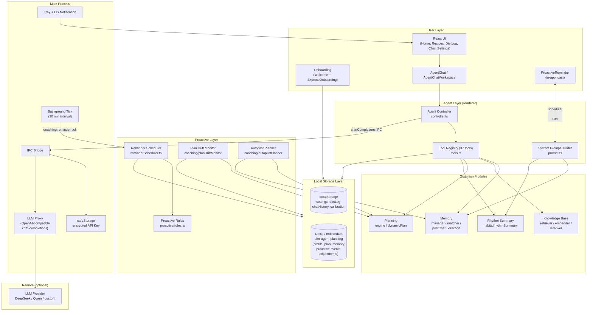
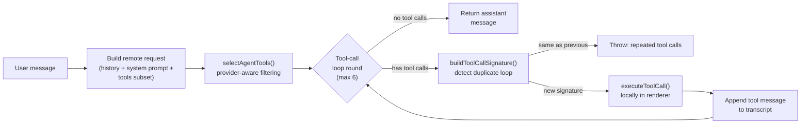
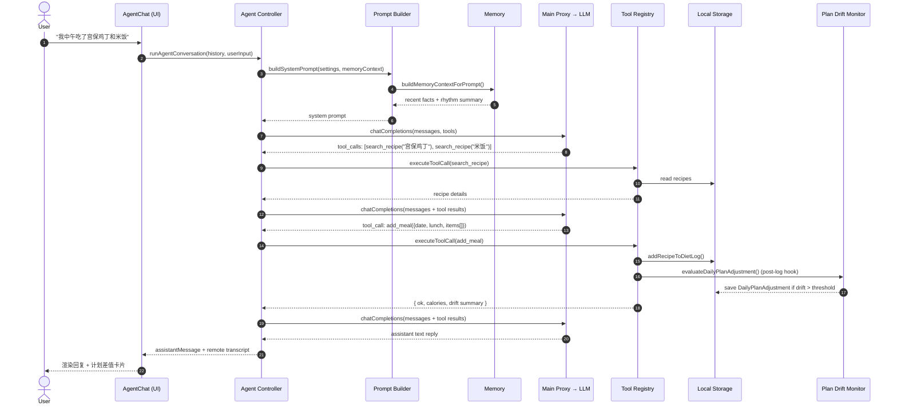
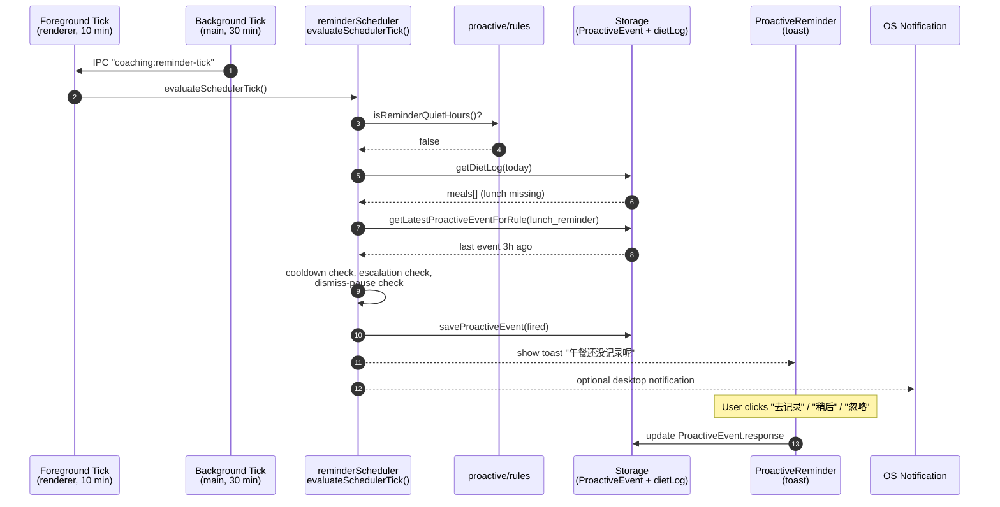

# Diet Agent 系统架构

> 本文档面向 Assignment 2 评审，从组件、数据流和时序三个角度描述 Diet Agent（「猫猫虫」）的整体架构。所有引用都指向当前仓库的实际代码。

## 1. 设计目标

Diet Agent 是一个**本地优先**的桌面端饮食教练 Agent，关键设计约束：

1. **不只是 chatbot**：必须能观察用户饮食记录、对照计划、主动触发提醒、根据偏好做长期个性化。
2. **本地优先**：饮食日志、计划、记忆全部存在本地（`localStorage` + Dexie/IndexedDB），不依赖云端后端。
3. **可审计**：动态计划建议、主动提醒、菜谱热量校准都要有审计记录，不能静默改写用户数据。
4. **安全边界**：远程 LLM API Key 由 Electron 主进程通过 `safeStorage` 加密，不进入渲染进程 `localStorage`。
5. **可演化**：Tool 系统可插拔，未来可以加入新工具（拍照识别、可穿戴接入等）而不必重写 controller。

## 2. 进程拓扑

应用基于 Electron 33 + electron-vite，分三个 JS 进程域：

| 进程 | 主要职责 | 入口 |
|---|---|---|
| Main Process | 窗口生命周期、托盘、OS 通知、API Key 安全存储、远程 LLM 代理、后台 30 分钟 tick | `src/main/index.ts`、`src/main/agent.ts` |
| Preload | 通过 contextBridge 暴露受限 IPC API 给渲染进程 | `src/preload/index.ts` |
| Renderer | UI、Agent 控制器、工具实现、计划/记忆/知识/提醒模块 | `src/renderer/src/**` |

把 Agent 的工具执行**放在渲染进程**是一个有意识的取舍：当前用户数据（饮食日志、设置、计划、记忆）都存在渲染进程可访问的 `localStorage` / Dexie 中，工具落在渲染进程可以直接读写，避免每次工具调用都跨 IPC 序列化整个数据结构。代价是渲染进程相对没那么安全，所以**只有 API Key 这种高敏感数据保留在主进程**。

## 3. 组件总览图

## 4. Agent 控制器内部结构

> 实现见 `src/renderer/src/agent/controller.ts:174-240`。`MAX_TOOL_ROUNDS = 6`，`MAX_HISTORY_MESSAGES = 20`。

## 5. 关键时序图

### 5.1 用户记录饮食的完整 agent loop

### 5.2 主动提醒（餐次未记录）

## 6. 模块职责表

| 模块 | 关键文件 | 职责 |
|---|---|---|
| Agent Controller | `src/renderer/src/agent/controller.ts` | 组装请求、运行 tool-call 循环（≤6 轮）、检测重复调用、按 provider 过滤工具子集 |
| System Prompt | `src/renderer/src/agent/prompt.ts` | 注入猫猫虫人设、用户昵称、当日卡路里目标、时间段、长期记忆摘要、饮食节奏摘要 |
| Tool Registry | `src/renderer/src/agent/tools.ts`（37 个工具） | 查询、记录、推荐、计划、记忆、知识库、校准、提醒偏好、页面跳转 |
| Memory | `memory/manager.ts`、`memory/matcher.ts`、`memory/postChatExtraction.ts`、`memory/prompt.ts` | 长期事实存储（preference / allergy / avoidance / habit / schedule / health_note / goal）、置信度评分、对话后异步提炼候选记忆、待确认状态 |
| Knowledge | `knowledge/retriever.ts`、`knowledge/embedder.ts`、`knowledge/reranker.ts`、`knowledge/data.ts` | 本地轻量知识库：常见食物营养、计划处理原则、安全边界 |
| Planning Engine | `planning/engine.ts` | 引导式资料采集、异常 BMI/目标差距追问、生成 PersonalDietPlan 与餐次比例 |
| Dynamic Plan | `planning/dynamicPlan.ts` | 计算 `DailyPlanGap`、生成补餐/减餐建议、夹带安全过滤（乳糖/医嘱/极端语言替换） |
| Proactive Scheduler | `coaching/reminderScheduler.ts` | 餐次未记录提醒、升级阈值、冷却、连续忽略暂停、周报提醒；前台 10 分钟 tick |
| Proactive Rules | `proactive/rules.ts` | 静音时段判定、提醒类型过滤、提醒偏好读写 |
| Plan Drift Monitor | `coaching/planDriftMonitor.ts` | 用户记录饮食后立即检查偏差，写 `DailyPlanAdjustment` 审计 |
| Autopilot Planner | `coaching/autopilotPlanner.ts` | 高置信度自动建议（autopilot 模式）vs 用户确认（precision 模式） |
| Rhythm Summary | `habits/rhythmSummary.ts` | 聚合过去 7~30 天的记录覆盖率、餐次频率、工作日强弱、高频食物，供 prompt 注入和 `get_user_rhythm_summary` 工具读取 |
| One-Tap Logger | `coaching/oneTapLogger.ts`、`coaching/textLogParser.ts`、`coaching/photoLogParser.ts` | 一行文字 / 拍照 / "和昨天一样" / 常见食物芯片快捷记录 |
| Express Onboarding | `coaching/expressOnboarding.ts`、`pages/ExpressOnboarding.tsx` | 60 秒走完性别/身高/体重/目标/活动水平 5 个字段生成专属计划 |
| Recipe Calibration | `stores/recipeCalibration.ts`、`data/recipeValidation.ts` | LLM 估算热量进入 pending 队列、人工审核后合并到生效菜谱，不改写 TS 源 |
| Main Agent Bridge | `src/main/agent.ts` | API Key 加密存储、`chat-completions` 代理、usage 统计、错误分类、OS 通知 |
| Main Window | `src/main/index.ts` | 单例锁、托盘、后台 30 分钟 tick、关闭即隐藏到托盘 |

## 7. 状态管理与持久化

| 数据 | 介质 | 文件 |
|---|---|---|
| 用户昵称、卡路里目标、AI 通道配置、提醒偏好、信任旋钮 | `localStorage` | `stores/settings.ts` |
| 每日饮食记录 | `localStorage`（按日期分 key） | `stores/dietLog.ts` |
| 聊天记录 | `localStorage`（上限 200 条） | `stores/chatHistory.ts` |
| 自定义食物 | `localStorage` | `stores/customFoods.ts` |
| 菜谱校准审计 | `localStorage` | `stores/recipeCalibration.ts` |
| 计划档案 / 会话 / PersonalDietPlan / 长期记忆 / ProactiveEvent / DailyPlanAdjustment / PlannedMeal | Dexie 数据库 `diet-agent-planning` | `stores/planning.ts` |
| API Key | Electron `safeStorage` 加密，写入 userData 目录 | `src/main/agent.ts` |
| Usage Stats（token / latency） | Electron userData JSON（上限 500 条） | `src/main/agent.ts` |

## 8. 安全与可审计边界

1. **API Key 不进 renderer**：渲染进程只能通过 IPC 触发 `chat-completions`，无法读出原 key（`src/main/agent.ts`）。
2. **工具白名单**：`controller.ts` 在 custom provider 下根据用户输入语义匹配启用工具子集，避免一次性把 37 个工具全发给 LLM 造成上下文爆炸。
3. **写操作要确认**：动态计划调整、记忆采纳（pending_confirm）、菜谱校准都先进入"待确认/待审核"状态，不静默改写正式数据。
4. **安全规则前置**：`dynamicPlan.ts` 中的 `HEALTH_CAUTION_RE`、`EXTREME_LANGUAGE_REPLACEMENTS` 会把"跳过下一餐"等过激措辞替换成温和表达。
5. **过敏 / 忌口优先级最高**：System Prompt 显式要求 Agent 推荐前先 `recall`，并通过 property test `allergyFilter.property.test.ts` 强制验证不会推荐冲突食材。
6. **审计可追溯**：所有主动事件、动态建议、校准记录都带触发规则、时间戳、原值、新值、用户响应，写入本地 Dexie。

## 9. 测试架构（详见 `TESTING.md`）

- **Tier 1（纯逻辑）**：parser、validator、scheduler、planner、reducer — 示例测试 + 属性测试。
- **Tier 2（集成胶水）**：agent controller、tools、IPC handler、preload bridge — 带确定性 mock 的集成测试。
- **Tier 3（展示层）**：React 组件 / 页面 — 挂载冒烟 + 一次交互断言。
- **覆盖率门禁**：全局 ≥80% 行 / ≥70% 分支；UI 层 ≥50% 行 / ≥40% 分支。
- **9 项不变量属性测试**：解析往返、静音时段、过敏过滤、估算自洽、计划不可变、菜谱校验、节奏幂等、记忆顺序无关、计划差值算术。

## 10. 演进路线

| 阶段 | 主线 | 状态 |
|---|---|---|
| v0.1 | 桌面端 MVP（菜谱/记录/统计/设置） | ✅ |
| v0.2 | 菜谱扩展到 130 道、周报、首次引导、动画 | ✅ |
| v0.3 | 猫猫虫 Agent + OpenAI 兼容 Tool Use | ✅ |
| v0.4 | AI 引导式专属计划 + 版本审计 | ✅ |
| v0.5 | 主动 Agent + 动态计划建议 + 长期记忆 | 🔄 部分（OS 通知有限） |
| v0.6 | 菜谱热量校准 + 数据治理 + 性能优化 | 🔄 部分 |
| 未来 | 真·拍照识别、可穿戴、多端同步 | ⬜ |
